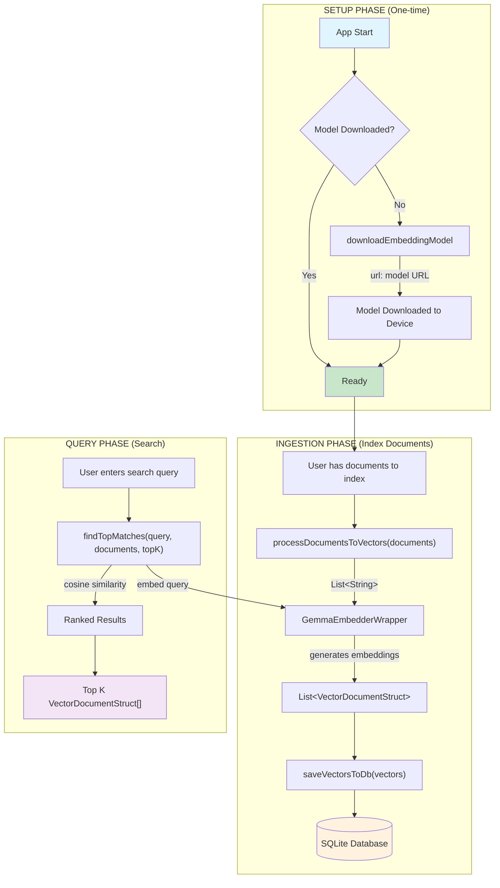
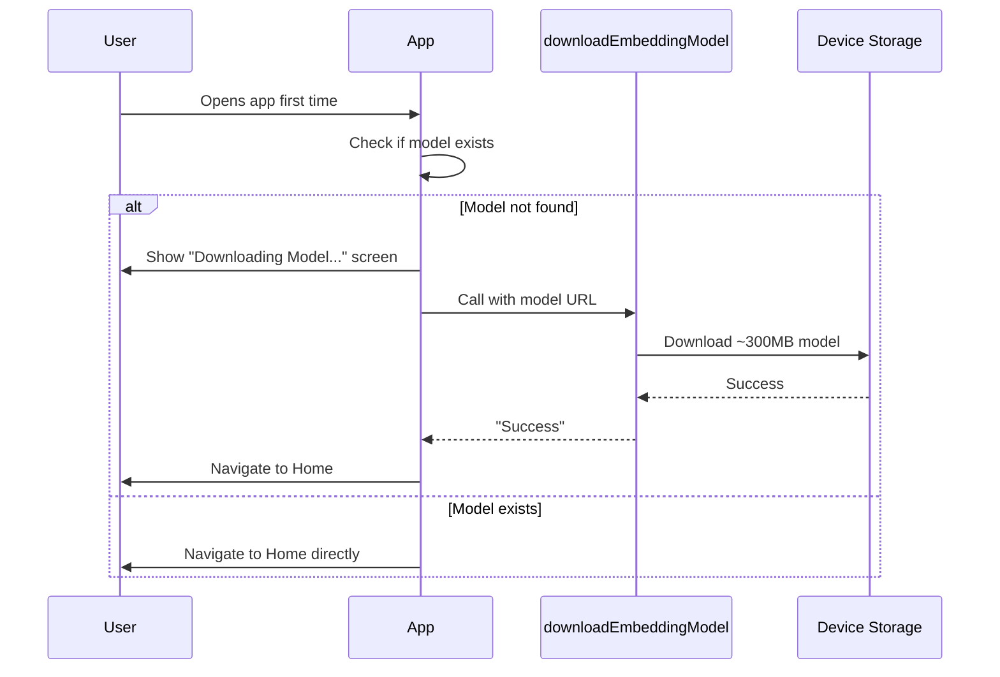
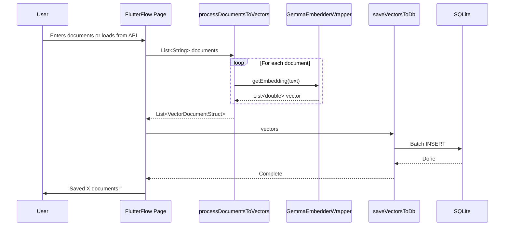
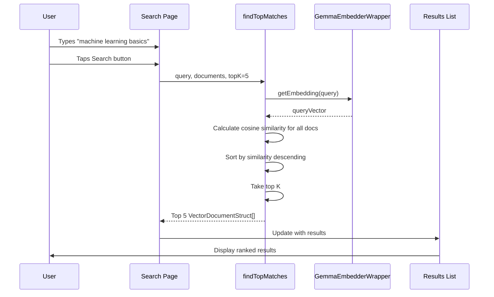

# FlutterFlow Gemma Embeddings Library - Usage Guide

## Overview

This library enables **on-device text embeddings** using Google's Gemma model for RAG (Retrieval-Augmented Generation) capabilities in FlutterFlow apps.

---

## Architecture Flowchart



---

## Component Reference

### Data Types

#### `VectorDocumentStruct` (Custom Data Type)

| Field | Type | Description |
|-------|------|-------------|
| `id` | String | Unique identifier (auto-generated if empty) |
| `text` | String | Original document text |
| `vector` | List&lt;double&gt; | Embedding vector (768 dimensions for Gemma) |
| `metadata` | String | Optional metadata (e.g., source, category) |

**Imported automatically in FlutterFlow Library** 

---

### Custom Actions

#### 1. `downloadEmbeddingModel`

**Purpose:** Downloads and installs the embedding model AND tokenizer. Required before any embedding operations.

```
downloadEmbeddingModel(modelUrl, tokenizerUrl) → String
```

| Parameter | Type | Required | Description |
|-----------|------|----------|-------------|
| `modelUrl` | String | Yes | URL to the embedding model (.tflite file) |
| `tokenizerUrl` | String | Yes | URL to the tokenizer (sentencepiece.model) |

| Returns | Description |
|---------|-------------|
| `"Success"` | Model and tokenizer installed successfully |
| `"Error: ..."` | Installation failed with error message |

**Recommended URLs (Gecko - NO authentication required):**
```
Model:     https://huggingface.co/litert-community/Gecko-110m-en/resolve/main/Gecko_256_quant.tflite
Tokenizer: https://huggingface.co/litert-community/Gecko-110m-en/resolve/main/sentencepiece.model
```

**FlutterFlow Usage:**
```
┌─────────────────────────────────────────────────┐
│ Action: downloadEmbeddingModel                   │
├─────────────────────────────────────────────────┤
│ modelUrl: "https://huggingface.co/litert-       │
│   community/Gecko-110m-en/resolve/main/         │
│   Gecko_256_quant.tflite"                       │
│                                                  │
│ tokenizerUrl: "https://huggingface.co/litert-   │
│   community/Gecko-110m-en/resolve/main/         │
│   sentencepiece.model"                          │
│                                                  │
│ Output Variable Name: downloadResult             │
└─────────────────────────────────────────────────┘
         │
         ▼
┌─────────────────────────────────────────────────┐
│ Conditional: downloadResult == "Success"         │
│   ├─ True:  Navigate to Main Page               │
│   └─ False: Show Error Snackbar                 │
└─────────────────────────────────────────────────┘
```

---

#### 2. `processDocumentsToVectors`

**Purpose:** Converts a list of text documents into embedding vectors.

```
processDocumentsToVectors(documents) → List<VectorDocumentStruct>
```

| Parameter | Type | Required | Description |
|-----------|------|----------|-------------|
| `documents` | List&lt;String&gt; | Yes | List of text documents to embed |

| Returns | Description |
|---------|-------------|
| `List<VectorDocumentStruct>` | Documents with their embedding vectors |

**FlutterFlow Usage:**
```
┌─────────────────────────────────────────────────┐
│ Action: processDocumentsToVectors                │
├─────────────────────────────────────────────────┤
│ documents: [                                     │
│   "The quick brown fox jumps over the lazy dog",│
│   "Machine learning is a subset of AI",         │
│   "Flutter is a cross-platform framework"       │
│ ]                                                │
│                                                  │
│ Output Variable Name: vectorDocs                 │
└─────────────────────────────────────────────────┘
```

---

#### 3. `saveVectorsToDb`

**Purpose:** Persists vector documents to the local SQLite database.

```
saveVectorsToDb(vectors) → void
```

| Parameter | Type | Required | Description |
|-----------|------|----------|-------------|
| `vectors` | List&lt;VectorDocumentStruct&gt; | Yes | Vector documents to save |

**FlutterFlow Usage:**
```
┌─────────────────────────────────────────────────┐
│ Action: saveVectorsToDb                          │
├─────────────────────────────────────────────────┤
│ vectors: vectorDocs  (from previous action)      │
└─────────────────────────────────────────────────┘
```

---

#### 4. `findTopMatches`

**Purpose:** Searches for the most similar documents to a query using cosine similarity.

```
findTopMatches(query, documents, topK) → List<VectorDocumentStruct>
```

| Parameter | Type | Required | Description |
|-----------|------|----------|-------------|
| `query` | String | Yes | Search query text |
| `documents` | List&lt;VectorDocumentStruct&gt; | Yes | Documents to search through |
| `topK` | int | No | Number of results (default: 5) |

| Returns | Description |
|---------|-------------|
| `List<VectorDocumentStruct>` | Top K most similar documents, ranked by similarity |

**FlutterFlow Usage:**
```
┌─────────────────────────────────────────────────┐
│ Action: findTopMatches                           │
├─────────────────────────────────────────────────┤
│ query: searchTextField.text                      │
│ documents: appState.allVectorDocs               │
│ topK: 5                                          │
│                                                  │
│ Output Variable Name: searchResults              │
└─────────────────────────────────────────────────┘
         │
         ▼
┌─────────────────────────────────────────────────┐
│ Update Page State: results = searchResults       │
│ Then: Rebuild ListView with results              │
└─────────────────────────────────────────────────┘
```

---

### Custom Widgets

#### `GenerateEmbeddings`

**Purpose:** Pre-built UI widget that handles the entire embedding + save workflow with progress indication.

| Parameter | Type | Required | Description |
|-----------|------|----------|-------------|
| `width` | double | No | Widget width |
| `height` | double | No | Widget height |
| `documents` | List&lt;String&gt; | No | Documents to process |
| `onComplete` | Action(int) | No | Callback with count of saved vectors |
| `onError` | Action(String) | No | Callback with error message |

**FlutterFlow Usage:**
```
┌─────────────────────────────────────────────────┐
│ Custom Widget: GenerateEmbeddings                │
├─────────────────────────────────────────────────┤
│ width: MediaQuery.sizeOf(context).width          │
│ height: 150                                      │
│ documents: pageState.documentsToEmbed            │
│ onComplete: [                                    │
│   Show Snackbar: "Saved ${count} vectors!"      │
│   Navigate to Search Page                        │
│ ]                                                │
│ onError: [                                       │
│   Show Snackbar: "Error: ${error}"              │
│ ]                                                │
└─────────────────────────────────────────────────┘
```

---

## Complete Workflow Diagrams

### Flow 1: Initial Setup (App First Launch)



### Flow 2: Document Ingestion



### Flow 3: Semantic Search



---

## FlutterFlow Action Chains

### Chain 1: Setup Flow

```
┌─────────────────────────────────────────────────────────────────┐
│                        ON PAGE LOAD                              │
├─────────────────────────────────────────────────────────────────┤
│                                                                  │
│  ┌──────────────────────────────────────────────────────────┐   │
│  │ 1. Custom Action: downloadEmbeddingModel                  │   │
│  │    modelUrl: "https://huggingface.co/litert-community/   │   │
│  │              Gecko-110m-en/resolve/main/                  │   │
│  │              Gecko_256_quant.tflite"                      │   │
│  │    tokenizerUrl: "https://huggingface.co/litert-community│   │
│  │              /Gecko-110m-en/resolve/main/                 │   │
│  │              sentencepiece.model"                         │   │
│  │    Output: downloadResult                                 │   │
│  └──────────────────────────────────────────────────────────┘   │
│                            │                                     │
│                            ▼                                     │
│  ┌──────────────────────────────────────────────────────────┐   │
│  │ 2. Conditional: downloadResult == "Success"               │   │
│  │    ┌─────────────────┐    ┌─────────────────────────┐    │   │
│  │    │ TRUE            │    │ FALSE                    │    │   │
│  │    │ Navigate to     │    │ Show Snackbar:          │    │   │
│  │    │ HomePage        │    │ "Download failed"       │    │   │
│  │    └─────────────────┘    └─────────────────────────┘    │   │
│  └──────────────────────────────────────────────────────────┘   │
│                                                                  │
└─────────────────────────────────────────────────────────────────┘
```

### Chain 2: Ingest Documents Flow

```
┌─────────────────────────────────────────────────────────────────┐
│                    ON BUTTON TAP: "Index Documents"              │
├─────────────────────────────────────────────────────────────────┤
│                                                                  │
│  ┌──────────────────────────────────────────────────────────┐   │
│  │ 1. Custom Action: processDocumentsToVectors               │   │
│  │    documents: pageState.documentsList                     │   │
│  │    Output: vectorDocs                                     │   │
│  └──────────────────────────────────────────────────────────┘   │
│                            │                                     │
│                            ▼                                     │
│  ┌──────────────────────────────────────────────────────────┐   │
│  │ 2. Custom Action: saveVectorsToDb                         │   │
│  │    vectors: vectorDocs                                    │   │
│  └──────────────────────────────────────────────────────────┘   │
│                            │                                     │
│                            ▼                                     │
│  ┌──────────────────────────────────────────────────────────┐   │
│  │ 3. Update App State                                       │   │
│  │    appState.allVectors = vectorDocs                       │   │
│  └──────────────────────────────────────────────────────────┘   │
│                            │                                     │
│                            ▼                                     │
│  ┌──────────────────────────────────────────────────────────┐   │
│  │ 4. Show Snackbar: "Indexed ${vectorDocs.length} docs!"   │   │
│  └──────────────────────────────────────────────────────────┘   │
│                                                                  │
└─────────────────────────────────────────────────────────────────┘
```

### Chain 3: Search Flow

```
┌─────────────────────────────────────────────────────────────────┐
│                    ON BUTTON TAP: "Search"                       │
├─────────────────────────────────────────────────────────────────┤
│                                                                  │
│  ┌──────────────────────────────────────────────────────────┐   │
│  │ 1. Custom Action: findTopMatches                          │   │
│  │    query: searchTextField.text                            │   │
│  │    documents: appState.allVectors                         │   │
│  │    topK: 5                                                │   │
│  │    Output: searchResults                                  │   │
│  └──────────────────────────────────────────────────────────┘   │
│                            │                                     │
│                            ▼                                     │
│  ┌──────────────────────────────────────────────────────────┐   │
│  │ 2. Update Page State                                      │   │
│  │    pageState.results = searchResults                      │   │
│  └──────────────────────────────────────────────────────────┘   │
│                            │                                     │
│                            ▼                                     │
│  ┌──────────────────────────────────────────────────────────┐   │
│  │ 3. ListView automatically rebuilds with new results       │   │
│  │    (bound to pageState.results)                          │   │
│  └──────────────────────────────────────────────────────────┘   │
│                                                                  │
└─────────────────────────────────────────────────────────────────┘
```

---

## Alternative: Using GenerateEmbeddings Widget

Instead of chaining `processDocumentsToVectors` + `saveVectorsToDb`, use the widget:

```
┌─────────────────────────────────────────────────────────────────┐
│                         PAGE LAYOUT                              │
├─────────────────────────────────────────────────────────────────┤
│                                                                  │
│  ┌──────────────────────────────────────────────────────────┐   │
│  │ Column                                                    │   │
│  │  ├─ Text: "Add your documents below"                     │   │
│  │  ├─ TextField: documentsInput (multiline)                │   │
│  │  └─ CustomWidget: GenerateEmbeddings                     │   │
│  │       ├─ documents: documentsInput.text.split('\n')      │   │
│  │       ├─ onComplete: [                                   │   │
│  │       │    Show Snackbar: "Saved ${count} vectors!"     │   │
│  │       │    Navigate to SearchPage                        │   │
│  │       │  ]                                               │   │
│  │       └─ onError: [                                      │   │
│  │            Show Snackbar: "Error: ${error}"             │   │
│  │          ]                                               │   │
│  └──────────────────────────────────────────────────────────┘   │
│                                                                  │
└─────────────────────────────────────────────────────────────────┘
```

---

## Database Schema

The SQLite database stores vectors in the `embeddings` table:

| Column | Type | Description |
|--------|------|-------------|
| `id` | TEXT (PK) | Unique document identifier |
| `content` | TEXT | Original document text |
| `embedding` | BLOB | Binary-encoded float64 vector |
| `metadata` | TEXT | Optional JSON metadata |

---

## Quick Reference Card

| Task | Action/Widget | Input | Output |
|------|---------------|-------|--------|
| Download model | `downloadEmbeddingModel` | modelUrl, tokenizerUrl | "Success" or "Error: ..." |
| Convert text to vectors | `processDocumentsToVectors` | List&lt;String&gt; | List&lt;VectorDocumentStruct&gt; |
| Save to database | `saveVectorsToDb` | List&lt;VectorDocumentStruct&gt; | void |
| Search similar docs | `findTopMatches` | query, docs, topK | List&lt;VectorDocumentStruct&gt; |
| All-in-one UI | `GenerateEmbeddings` widget | documents, callbacks | Built-in UI |

---

## Common Patterns

### Pattern A: Load Documents from API, Then Index

```
1. API Call → Get List<String> documents
2. processDocumentsToVectors(documents) → vectors
3. saveVectorsToDb(vectors)
4. Update App State with vectors for searching
```

### Pattern B: User Input Documents

```
1. User types in TextField (one doc per line)
2. Split by newline → List<String>
3. Use GenerateEmbeddings widget OR action chain
```

### Pattern C: Hybrid Search Page

```
1. On Page Load: Load vectors from App State (or query SQLite)
2. On Search: findTopMatches(query, loadedVectors, 10)
3. Display results in ListView
```

---

## Troubleshooting

| Issue | Cause | Solution |
|-------|-------|----------|
| Empty embeddings | Model not downloaded | Call `downloadEmbeddingModel` first |
| Slow processing | Large documents | Chunk documents into smaller pieces |
| Search returns empty | No vectors in memory | Load vectors from DB or App State first |
| App crashes on embed | Insufficient memory | Use smaller batch sizes |
